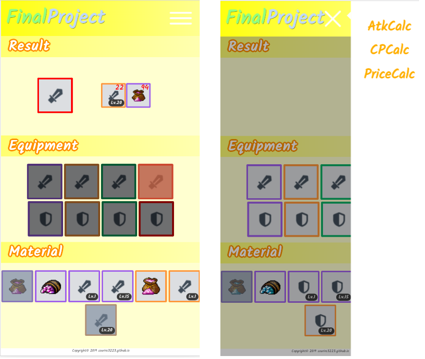
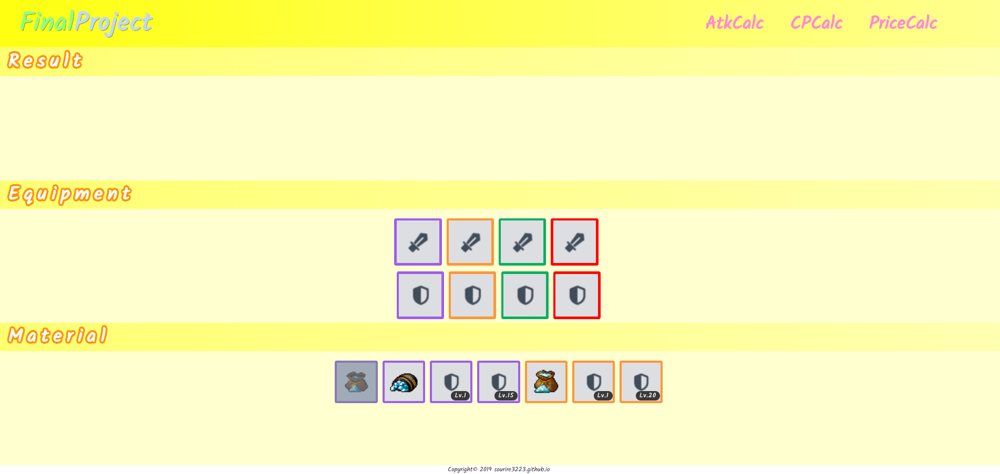

Frontend Programming - Final Project
===
[TOC]
## 網頁連結
https://sourire3223.github.io/final/

## 程式碼連結（有原始檔及minified檔）

https://github.com/sourire3223/sourire3223.github.io/tree/master/final/
- 原始檔：&#x09;&#x09;finalproject.html&#x09;finalproject.css&#x09;&#x09;finalproject.js
-  minified：&#x09;index.html &#x09;&#x09;&#x09;finalproject.min.css&#x09;finalproject.min.js
## 期末專題主題簡介

這是某個遊戲的強化裝備計算機。

由於遊戲中的數據都是不公開的，因此先在遊戲中實驗、統計出各個數據，用簡單的介面呈現結果。

以下為使用截圖（手機 / PC）：





## 使用者如何使用網站

1. 先在Equipment點選要被強化的裝備。
2. 接著在Material選擇要使用的肥料。
3. 結果會顯示在Result的地方。

## 你在這次專題中做了什麼，使用了什麼技術

### User Interface
#### 靜止
- 全部都是用大小都是用`vh`、`vw`寫的，可以符合各種大小的視窗，畢竟是手遊的計算機，希望能達到一些RWD。
#### 動態
- 雖然是以比例為大小設定，但在長寬比很大的時候，將少部分可能會重疉的部分以按鈕及選單方式呈現。
- 開啟選單的按鈕，以css的animation將原本的`三`字形變成打開後的`X`字形。
- 特別在手機上用JavaScript監聽觸摸事件，增加左滑出選單/及收起選單功能。
### 實際功能
- 用大量的半透明的linear-gradient疊出和遊戲中相似的效果。
- 從在覆蓋濾鏡及未覆蓋濾鏡的顏色回推濾鏡的色碼（為了復原遊戲中的真實效果），以下為公式及示範。
  
    假設底色為 $C_底=(R_底,G_底,B_底)$ ，覆蓋後的顏色為 $C' = (R_後,G_後,B_後)$，以及想要知道的濾鏡的色碼 $(C_濾'',A_濾'') = (R_濾'',G_濾'',B_濾'',A_濾'')$ ，其中$A_濾$是透明度。則有以下關係。
$$
C_後 = C_底(1-A_濾) + C_濾A_濾
$$
很明顯的，這裡有4個未知數卻有只有3個方程式，所以需要兩組前後的顏色。
```
底         後          
#DCDEE1 -> #A0AAB6      計算結果
                    >-> #79889A99
#663009 -> #6C6260 
```

## 你的網站有什麼特色、亮點
1. 在任何裝置上都只佔一頁螢幕（所有高度排版加總100vh），特別是可以使用在手機螢幕上，
2. 數據有一些使用者試用過了，目前還沒有出現數據錯誤的BUG。
